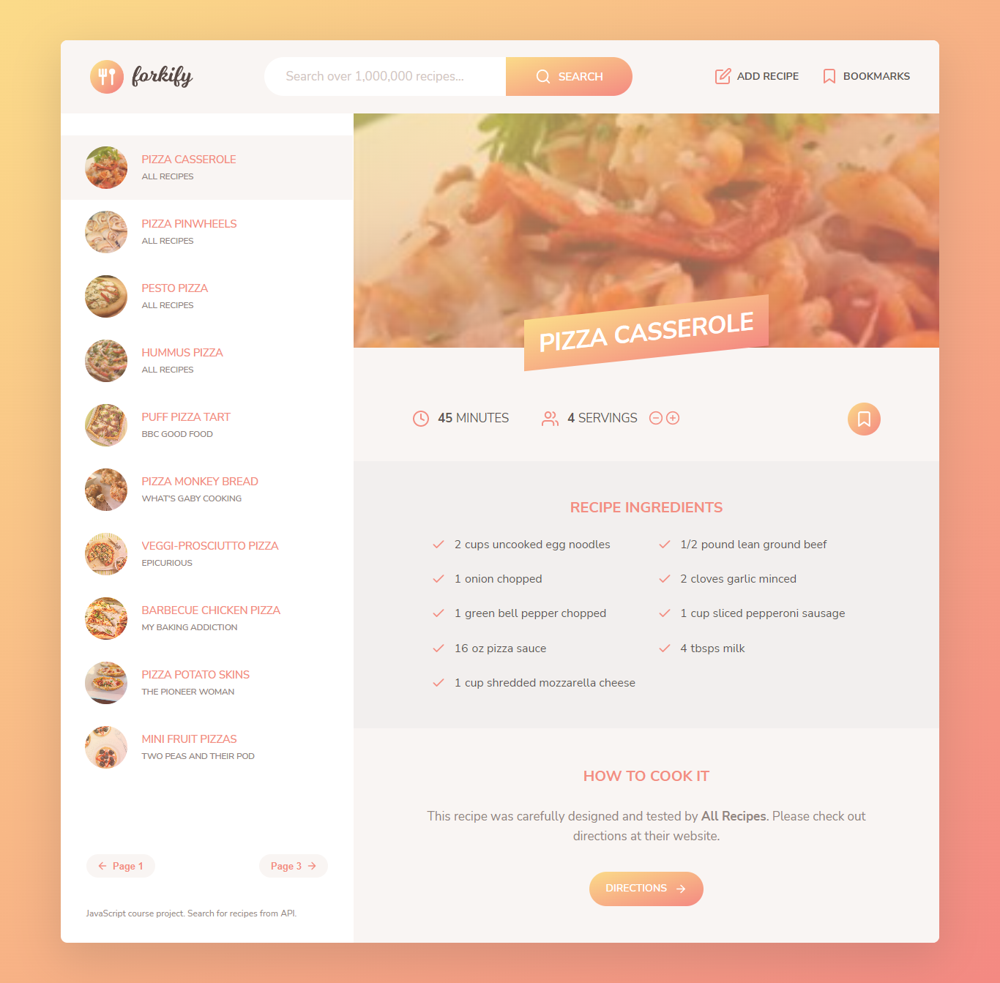

# Forkify Recipe App

## Welcome! 👋

This is a very simple recipe app that users can search for recipes.

Users can bookmark their favorite recipes and check them again later.

Users can upload their own favorite recipes.

## How it works

To search for a recipe the user simply types a search key word for a recipe like 'Pizza' or and ingredient like 'Avocado'.

Then on the sidebar your search results will appear. To render on the main view just click on any.

## Technologies Used

1. HTML
2. CSS (Grid / Flex)
3. Vanilla JavaScript (Recipe API - By Jonas SchedtsMann)
